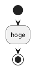

# Spring Boot学習 Injectionについて


## 依存性の注入（DI）

> 依存性の注入（いそんせいのちゅうにゅう、英: Dependency injection）とは、コンポーネント間の依存関係をプログラムのソースコードから排除するために、外部の設定ファイルなどでオブジェクトを注入できるようにするソフトウェアパターンである。英語の頭文字からDIと略される。
>
> [Wikipediaより](https://ja.wikipedia.org/wiki/%E4%BE%9D%E5%AD%98%E6%80%A7%E3%81%AE%E6%B3%A8%E5%85%A5)

コンポーネント間の依存関係をプログラムのソースコードから排除し、外部の設定ファイルなどで実行時に注入できるようにするソフトウェアパターンです。  
ここで言うコンポーネントとは、クラスと置き換えてもさしつかえありません。  

### 依存性

クラスAでクラスBをインスタンス化すると、クラスAはクラスBなしでは動作しません。  
この状態は、クラスAとクラスBが依存関係にある、と言えます。  
コードだと以下のような状態。

```
public class ClassA {
    public static void main(String... args) {
        ClassB classB = new ClassB();
        System.out.println(classB.execute());
    }
}

public class ClassB {
    public execute() {
        System.out.println("ClassB::execute()");
    }
}
```

### 注入

直接`new`するのではなく、設定などの外部ファイルに記載しておいて、実行時に指定クラスのインスタンスを割り当てることを言います。  
こういったことをやってくれる機能をDIコンテナと言います。  

SpringにはこのDIコンテナがあるので、設定をしておくと実行時にインスタンスを注入してくれます。  

### Spring BootのDI

SpringのDIコンテナにbeanとして登録するために、Springアノテーションを使います。  
以下のアノテーションは動作としてはいずれも同じなので、名前通りの使い分けで良いようです。  

|アノテーション|使い所|
|-------------|------|
| `@Service` | サービス層に配置 |
| `@Repository` | データ層に配置 |
| `@Controller` | コントローラ層に配置 |
| `@Component` | その他 |

DIコンテナに登録したクラスでは、注入が使えるようになります。  
注入はアノテーションで表現でき、以下の種類があります。

|アノテーション|パッケージ|
|-------------|----------|
| `@Autowired` | org.springframework.bean.factory |
| `@Inject` | javax.inject |
| `@Resource` | javax.annotation |

動作は変わらないので、ここでは`@Autowired`を使っていきます。
`@Autowired`で指定したインスタンスが注入されます。





## 参考資料

[DI(依存性注入)について](https://www.slideshare.net/yuiito94/di-56742600)
[@Component、@Service、@Repository、@Controllerの違いについて](https://qiita.com/KevinFQ/items/abc7369cb07eb4b9ae29)
